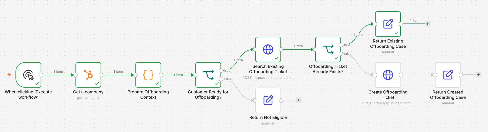
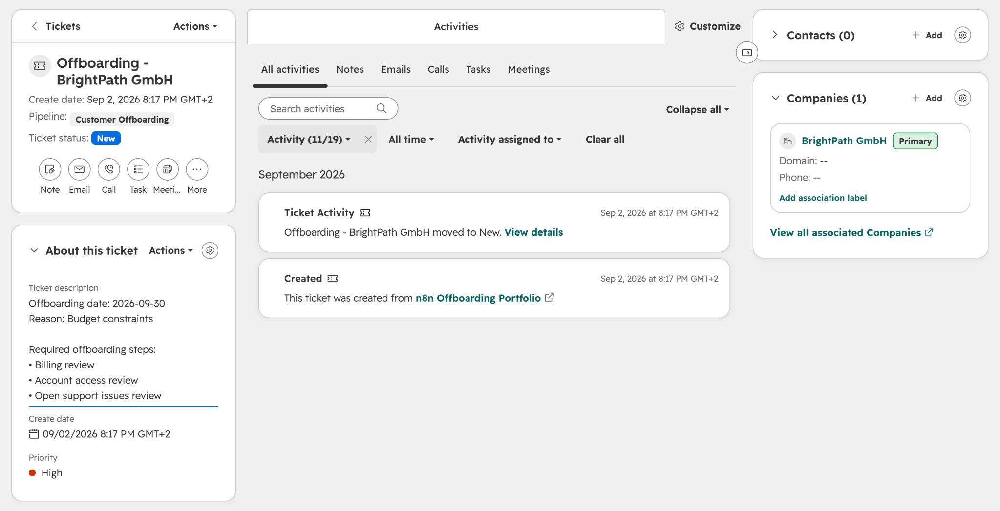

# Customer Offboarding Automation

An n8n workflow that checks customer offboarding data in HubSpot, works out which reviews are needed, and creates a ticket without duplicating an existing case.

**Stack:** n8n · HubSpot CRM · JavaScript · REST APIs · JSON

I built this project based on customer offboarding processes I managed and improved in previous SaaS roles. I kept it focused. The workflow prepares the case and prevents duplicates, while the responsible teams handle the actual offboarding work.

## The problem

Customer offboarding rarely sits neatly with one team.

Finance may need to review billing, support teams need context on open issues, and some customers require a data export or another review before the account can be closed.

That makes the handoff easy to get wrong. If the CRM record is incomplete, important information can be missed. If nobody checks for an existing case, the same customer may end up with two tickets.

This workflow takes care of that first step: it checks the data, prepares the case, and makes sure the ticket does not already exist.

## How it works

1. A manual trigger starts the workflow with a selected HubSpot company.
2. A JavaScript node cleans, checks, and evaluates the relevant CRM data.
3. The workflow stops if the customer is not ready for offboarding.
4. Business rules work out which review steps the case needs.
5. The workflow builds an idempotency key and searches HubSpot tickets through the REST API.
6. If it finds a matching ticket, it returns the existing case. If not, it creates a new ticket and links it to the company.

Every run ends with one clear result: `created_case`, `existing_case`, or `not_eligible`.

## Design decisions

Creating a HubSpot ticket isn't the hard part. The hard part is knowing when the workflow should create one, when it should stop, and how to keep repeat runs from creating duplicates.

**Keep everything in HubSpot.** The company data and offboarding case already belong in the CRM. Adding a spreadsheet or another database would mean maintaining the same process in two places.

**Check the status first.** The workflow only continues when `customer_status` is set to `offboarding in progress`. Any other status stops before the ticket search.

**Validate only what the case needs.** The workflow checks the core company and rule fields first. The offboarding date and reason become required once a company is eligible. Active customers don't need offboarding details simply to be rejected by the workflow.

**Turn CRM fields into a useful case.** Every eligible company starts with billing, account access, and support checks. Customer tier, data export, and finance flags add extra review steps when needed. This keeps the case consistent without trying to automate the operational work itself.

**Look before creating.** Someone may run the workflow more than once, especially during testing. It always searches HubSpot for an existing offboarding case before creating a new ticket.

**Give every case a stable key.** The workflow builds an idempotency key from the HubSpot company ID: `offboarding:{companyId}`. I configured the matching HubSpot ticket property to accept unique values, adding another safeguard against duplicates.

**Automate the preparation, not the execution.** The workflow identifies the required reviews and adds them to the ticket. Account deactivation, data exports, billing changes, and customer communication stay with the responsible teams.

**Use a manual trigger for predictable tests.** I can select a demo company and test each path without waiting for a live CRM event. In a live setup, a confirmed HubSpot status change or a scheduled search could start the workflow instead.

## Tested scenarios

I tested the three main paths with demo company records in HubSpot.

**New offboarding case**

An eligible company without an existing case received a new high-priority ticket. The workflow added the offboarding details and required reviews, then linked the ticket to the correct company.

**Repeat run**

Running the same company again returned `existing_case` with the original ticket ID and URL. The workflow did not create a second ticket.

**Not eligible**

A company with an active customer status returned `not_eligible`. The workflow stopped before searching for or creating a ticket.

## Scope

The workflow focuses on preparing the offboarding case, applying the business rules, and preventing duplicate tickets.

It does not deactivate accounts, export customer data, change billing, or send customer communication. Those steps stay with the responsible teams because they require clear ownership, approvals, and additional safeguards.

## Running the workflow

1. Import `workflow.json` into n8n.
2. Connect your own HubSpot credential and add the custom properties used by the workflow.
3. Update the ticket pipeline and stage IDs for your HubSpot account.
4. Select a demo company and run the workflow manually.
